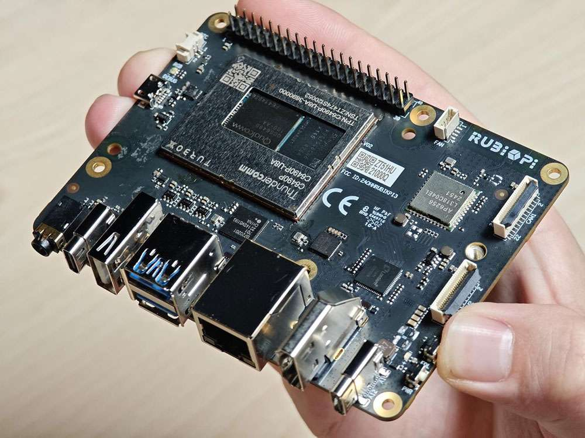
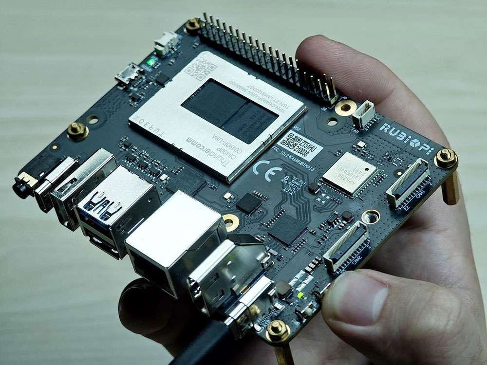
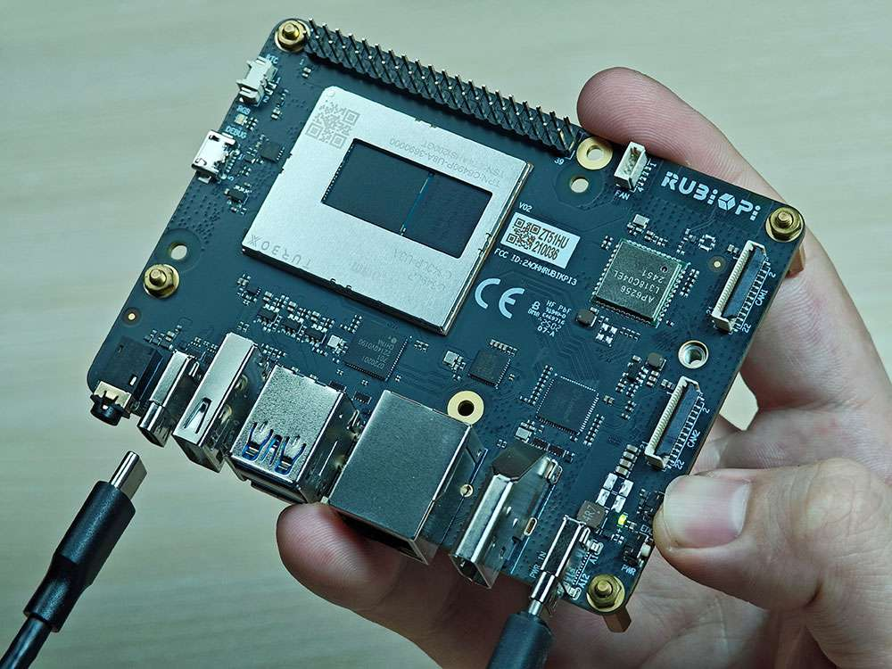

# Flashing Ubuntu

## Flash images

### Place device in EDL mode

1. Press and hold the **\[EDL]** button (No. 12 in the figure above).

    

2. Connect the power supply into port 10, as shown in the figure below.&#x20;

    

3. Insert the Type-C cable into port 5 and wait three seconds to enter 9008 mode.

   

### Place device in EDL mode

Select your operating system for detailed flashing instructions:

- **[Windows](subsystem/windows.md)** - Windows-specific flashing instructions
- **[Linux](subsystem/linux.md)** - Linux/Ubuntu-specific flashing instructions  
- **[Mac](subsystem/mac.md)** - macOS-specific flashing instructions
