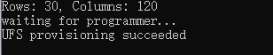

# Flash images on a Windows system

<a id="flashwin"></a>

1. Install the WinUSB driver. (If you have installed it, skip this step.)
 
   1. Uninstall other drivers for this device. Make sure that Qualcomm USB drivers and similar drivers are not installed. 

     * The device should not appear under the COM ports in Device Manager. If you see the device under the COM ports, follow the instructions to uninstall QUD.  

     

     * Ensure that **Delete the driver software for this device** is checked.

     

   2. Power off the device and re-enter the flashing mode. Follow the instructions below to install Microsoft WinUSB.

     * In Device Manager, right-click the USB port of RUBIK Pi 3 and select **Update driver.**

     

     * In the pop-up window, choose the **Browse my computer for driver software** option.

     

     * Under USB devices, select **WinUsb Device**.

     

     * Click **Yes** to update the driver.

     

2. In the terminal, use the following command to run the QDL executable from either the *QDL_Win_x64* or *QDL_Win_ARM64* directory based on your host architecture to flash the image. Once the flashing process is complete, the device will automatically reboot.

:::note
>
> The program file name does not support wildcards. Each image file must be listed in the command explicitly.

>
> Replace `<pathToQDL>` with the actual location of the *QDL_Win_x64* or *QDL_Win_ARM64* directory.
:::

```shell
<pathToQDL>\QDL.exe prog_firehose_ddr.elf rawprogram0.xml rawprogram1.xml rawprogram2.xml rawprogram3.xml rawprogram4.xml rawprogram5.xml rawprogram6.xml patch0.xml patch1.xml patch2.xml patch3.xml patch4.xml patch5.xml patch6.xml
```


3. If your RUBIK Pi 3 fails to boot up after flashing, enter the *provision* directory in the FlatBuild package and run the following command to try provisioning UFS. 
:::warning
>
> After provisioning, some information stored in the UFS, such as the SN and Ethernet MAC address, may be lost.
>
> Replace `<pathToQDL>` with the actual location of the *QDL_Win_ARM64* or *QDL_Win_x64* directory.
:::

```shell
<pathToQDL>\QDL.exe prog_firehose_ddr.elf provision_ufs_1_3.xml
```



:::warning
>
> After provisioning, remove and plug in the power supply and USB cable to restart your RUBIK Pi 3 and proceed with the image flashing again.
::: 