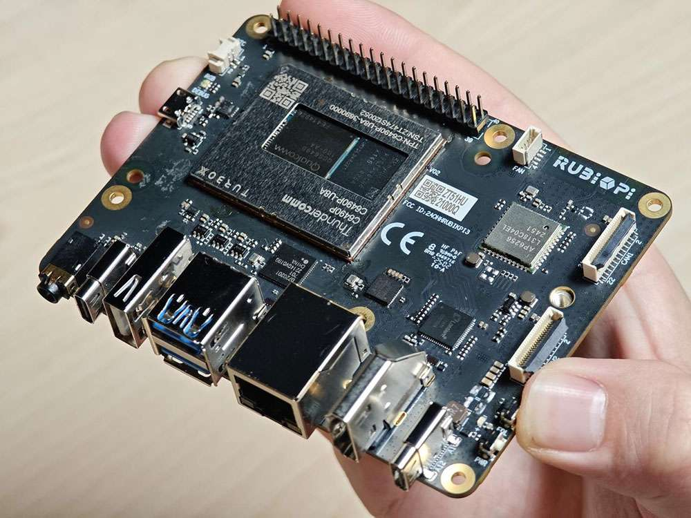
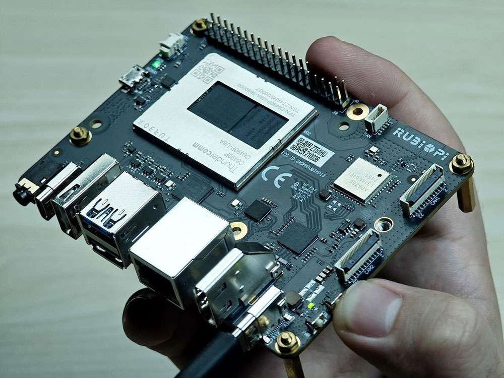
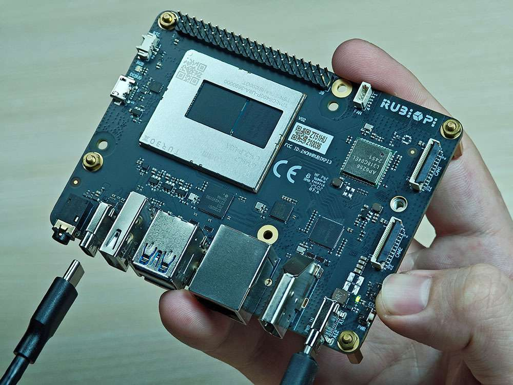

# EDL Mode (Emergency Download Mode)

## 1. Press and hold the **\[EDL]** button (No. 12 in the figure above).

    

## 2. Connect the power supply into port 10, as shown in the figure below.&#x20;

    

## 3. Insert the Type-C cable into port 5 and wait three seconds to enter 9008 mode.

   

