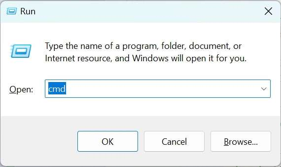
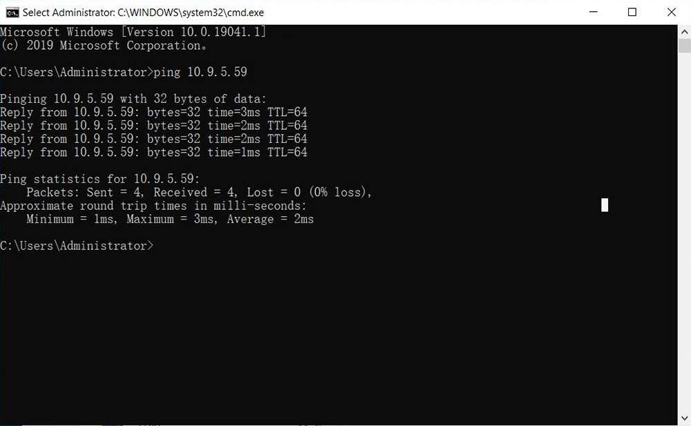
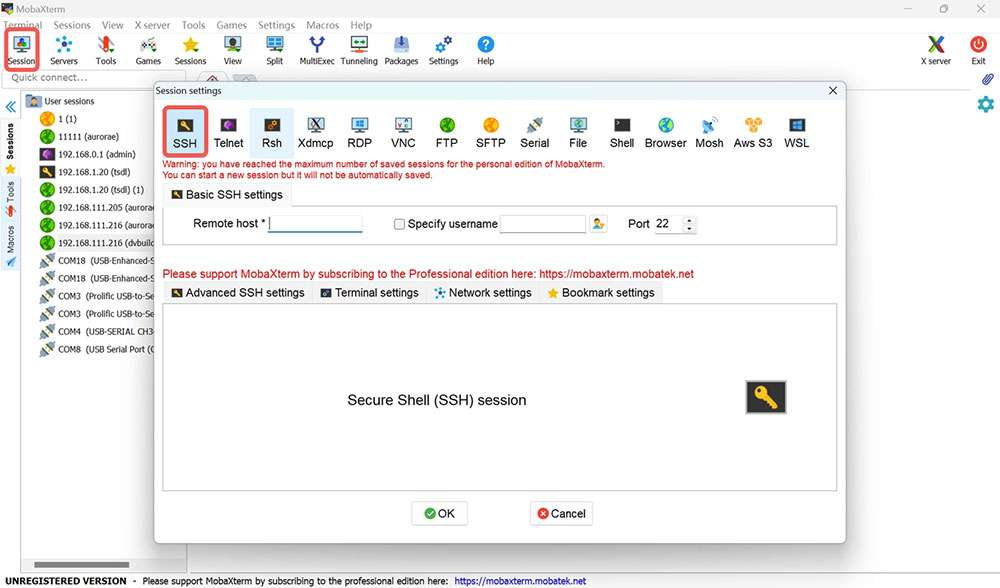
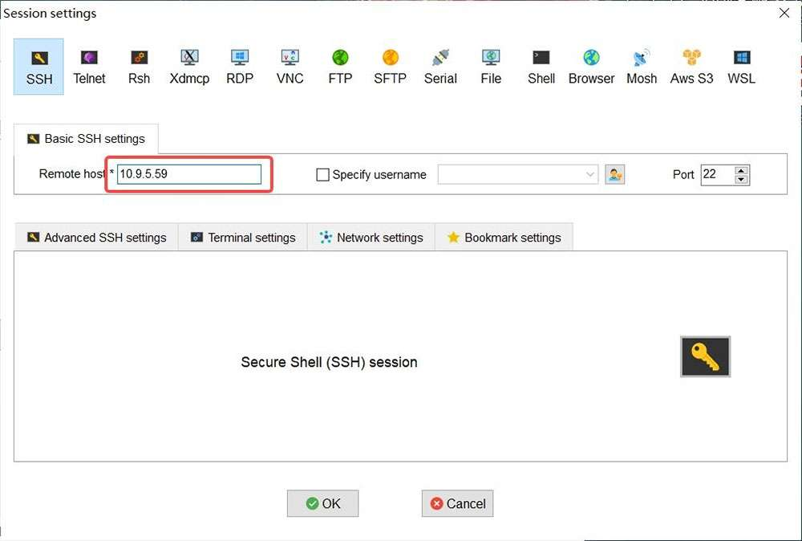
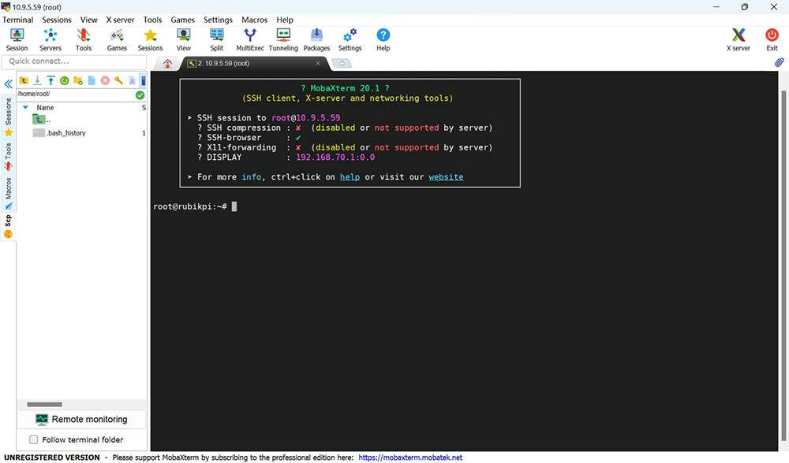
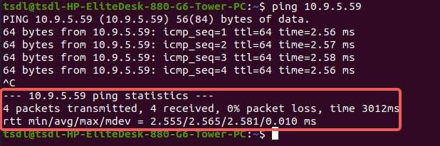
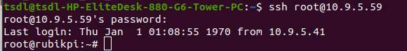

# SSH login

import Tabs from '@theme/Tabs';
import TabItem from '@theme/TabItem';

<Tabs>
<TabItem value="windows" label="Windows">

### 1. Ping the RUBIK Pi 3 IP address.

   #### 1. Obtain the IP address.

      * Log in to the backend of the router or use other IP scanning software to obtain the IP address of RUBIK Pi 3.

      * Log in to RUBIK Pi 3 via ADB and run the `ifconfig` command to obtain the IP address.

        :::note
        
        The IP address may change depending on the network environment, and the device name of RUBIK Pi 3 is "rubikpi".
        :::

   #### 2. Press **Win**+**R**, type "cmd" in the pop-up window, and click **OK**.

    
      
   #### 3. Run the `ping <IP>` command in the terminal. For example, the IP address of RUBIK Pi 3 is 10.9.5.59, run the following command and view the execution result.
    ```
    ping 10.9.5.59
    ```
    


### 2. SSH login.

   #### 1. Open MobaXterm.

    

   #### 2. Click **Session** and select SSH in the pop-up window.

    

   #### 3. Type the IP address of the RUBIK Pi 3 you want to log in to and click **OK**.

    

   #### 4. Type the username, press **Enter**, type the password, and press **Enter** to log in to RUBIK Pi 3.

    

   #### 5. The following information indicates that the login is successful. 
    

</TabItem>
<TabItem value="ubuntu" label="Ubuntu">

### 1. Confirm the network connection.

   #### 1. Obtain the RUBIK Pi 3 IP address.

      * Log in to the backend of the router or use other IP scanning software to obtain the IP address of RUBIK Pi 3.

      * Log in to RUBIK Pi 3 via ADB and run the `ifconfig` command to obtain the IP address.

        :::note
         The IP address may change depending on the network environment, and the device name of RUBIK Pi 3 is "rubikpi".
        :::

   #### 2. Run the `ping <IP>` command in the Ubuntu terminal. For example, the IP address of RUBIK Pi 3 is 10.9.5.59, run the following command and view the execution result.

      ```shell
      ping 10.9.5.59
      ```

       

### 2. SSH login.

   #### 1. Type the `ssh <user>@<IP>` command in the Ubuntu terminal and press **Enter**, as shown in the following figure. `root` indicates the role you want to log in as. `10.9.5.59` indicates the IP address of RUBIK Pi 3.

     ```shell
     ssh root@10.9.5.59
     ```

  #### 2. Type the password and press **Enter**. The login succeeds.

     

</TabItem>
</Tabs>
