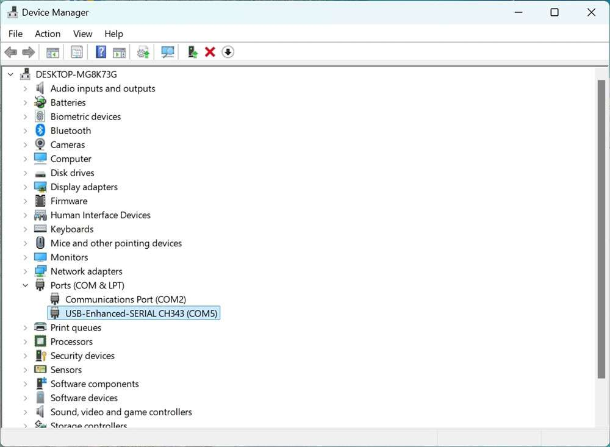
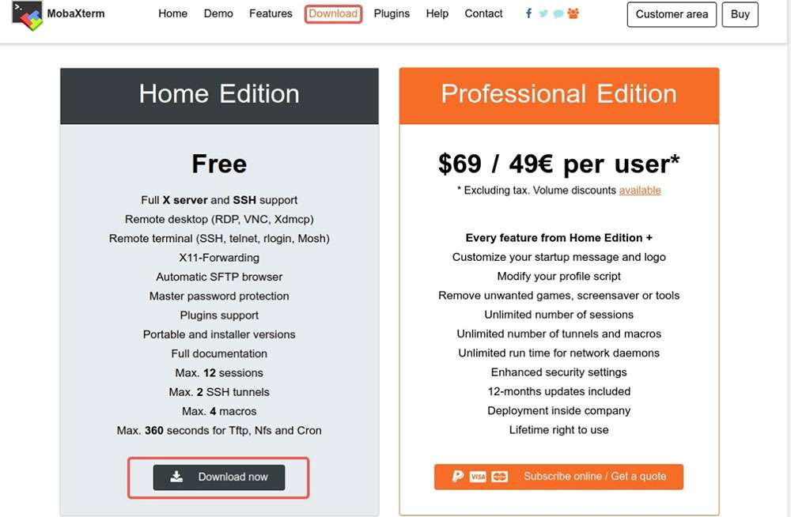
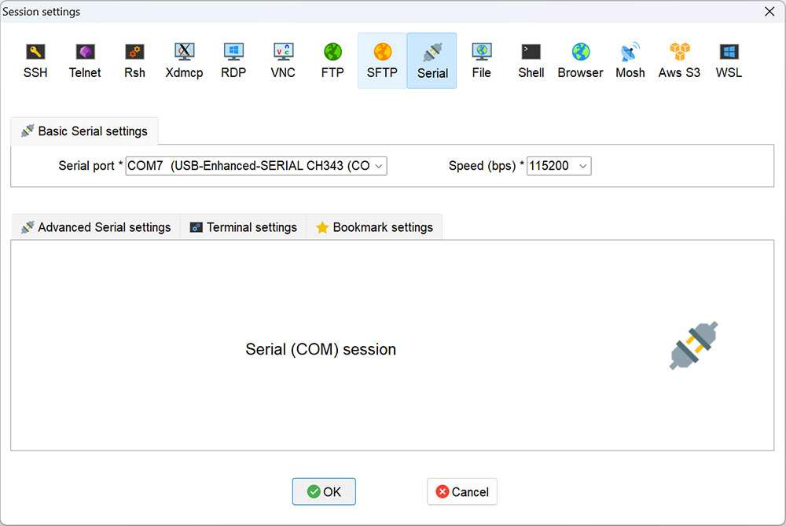
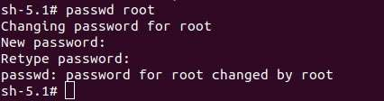
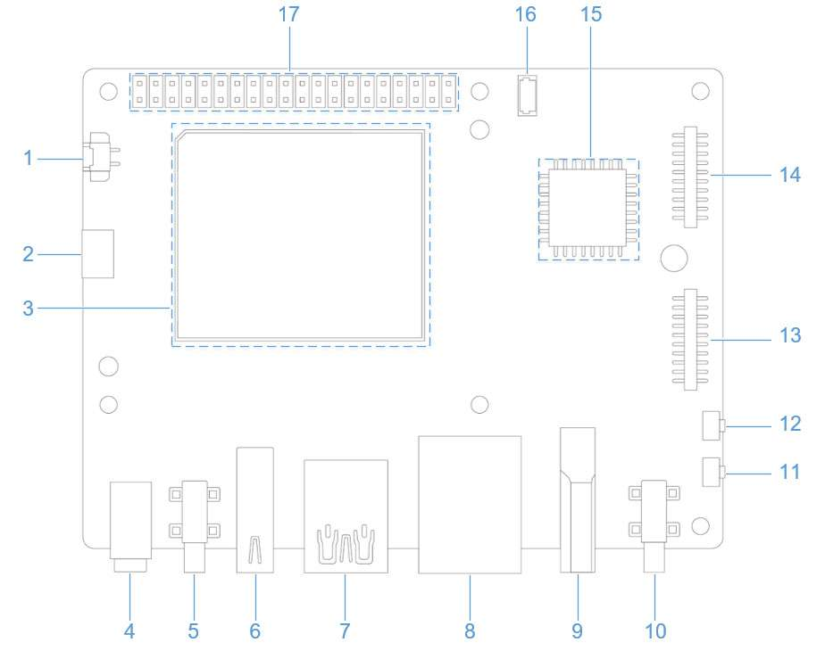
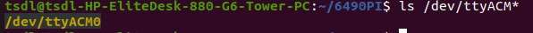
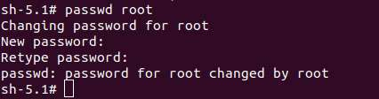

import Tabs from '@theme/Tabs';
import TabItem from '@theme/TabItem';

# UART login

<Tabs>
<TabItem value="windows" label="Windows">

1. Connect port 2 in the following figure to a computer via a UART interface.

   

2. Open the computer settings page, check the corresponding COM port in Device Manager, and record the port.

   

3) Download MobaXterm at https://mobaxterm.mobatek.net/ and decompress it.

   

4) Open MobaXterm, select **Session** > **Serial**, and set the baud rate of the serial port to 115200.

   

   

5. Click **OK**. Press **Enter** and type your login name and the default login password to log in:

   <p>Login account: ubuntu</p>
   <p>Login password: ubuntu</p>
   
   :::tip
   You can run the `passwd` command to change the default password. For example: `passwd root`.
   :::

  

</TabItem>
<TabItem value="ubuntu" label="Ubuntu">

1. Connect port 2 in the following figure to a computer via a serial cable.

   

2. Run the following commands to install minicom:

   ```shell
   sudo apt update  
   sudo apt install minicom
   ```

3) Run the following command to check the USB port:

   ```shell
   ls /dev/ttyACM*
   ```

    

4. Run the following command to open minicom. Press **Enter** and type your login name and the default login password to log in:

   ```shell
   sudo minicom -D /dev/ttyACM0 -b 115200
   ```

   <p>Login account: root</p>
   Login password: rubikpi

   :::note
   You can run the `passwd` command to change the default password. For example: `passwd root`.
   :::

    

</TabItem>
</Tabs>
