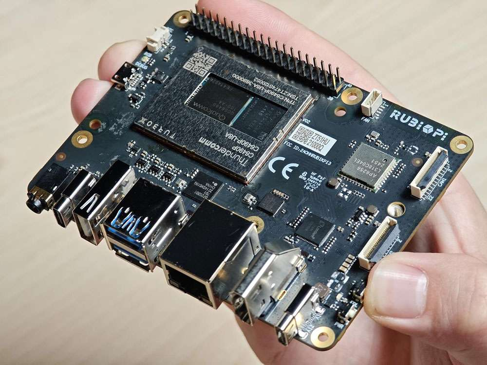
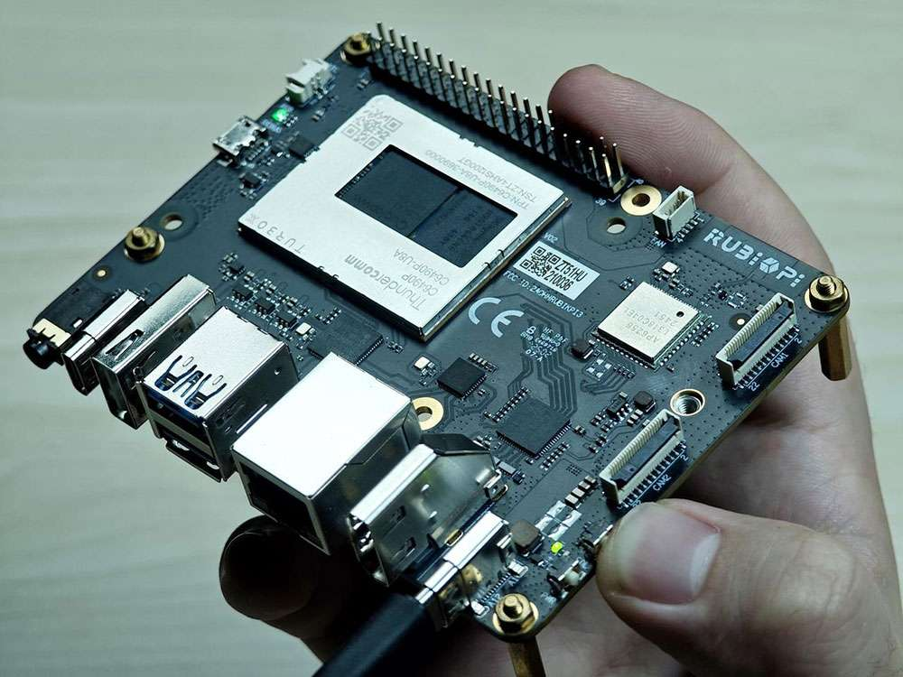
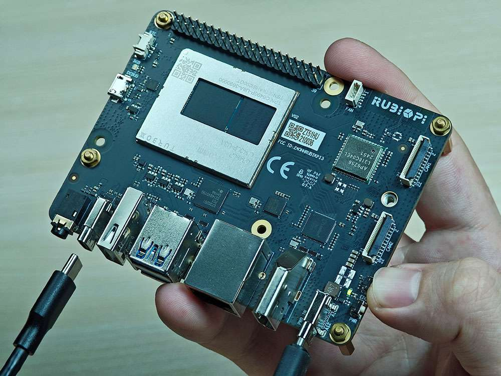

# Flashing Ubuntu

## Flash images

### Place device in EDL mode

1. Press and hold the **\[EDL]** button (No. 12 in the figure above).

    

2. Connect the power supply into port 10, as shown in the figure below.&#x20;

    

3. Insert the Type-C cable into port 5 and wait three seconds to enter 9008 mode.

   

### Flash the device

For detailed platform-specific flashing instructions, see:

**[Platform-Specific Flashing Instructions](platform_specific_flashing.md)** - Choose your operating system (Windows, Linux, or Mac) from the tabs
