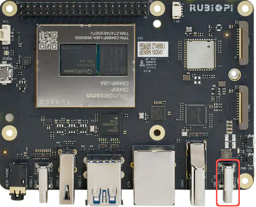
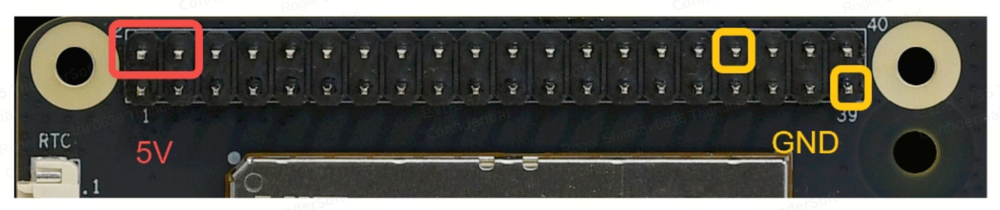
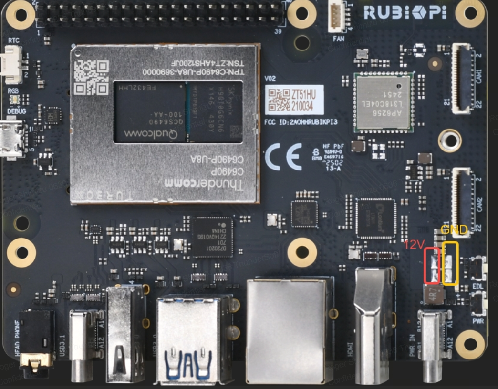

# Power
The RUBIK Pi can take a maximum of 36w in a variety of ways listed below 

:::warning
Give the RUBIK-Pi at least 20w. If given 15w brown outs might happen depending on processing requirments.
:::
### USB-C

The USB-C port adjacent to the buttons, labelled 'PWR IN', can be used to power the RUBIK Pi with a USB-C power supply or an external battery pack.

### GPIO

Either of the 5V pins and any of the GND pins on the GPIO header can be used to power the board. These can be powered in the same method as [recommended by PhotonVision](https://docs.photonvision.org/en/latest/docs/quick-start/common-setups.html#power) for other Pi development boards, using a voltage regulator like one of these:

- Pololu S13V30F5 Regulator
- Redux Robotics Zinc-V Regulator

### Soldered

The RUBIK Pi can also be powered by soldering directly to the leads shown in the diagram below.

:::warning
This method has not been tested with typical FRC power supplies, which may have insufficient voltage regulation.
:::

