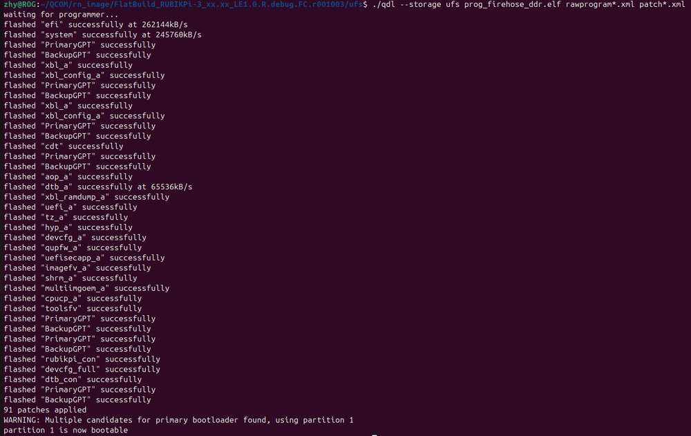
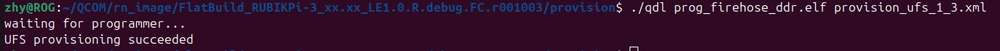

# Flash images on a Linux system

1. Run the following command to install libusb, libxml2 (If you have installed them, skip this step.)

```shell
sudo apt-get install libxml2-dev libudev-dev libusb-1.0-0-dev
```

2. Go to the *ufs* directory of the FlatBuild package.

3. Copy the *qdl* file from the *QDL_Linux_x64* or *QDL_Linux_ARM* directory to the *ufs* directory, depending on your host architecture.

4. Run the following command to flash the image.

```shell
./qdl --storage ufs prog_firehose_ddr.elf rawprogram*.xml patch*.xml
```



5. If your RUBIK Pi 3 fails to boot up after flashing, enter the *provision* directory in the FlatBuild package and run the following command to try provisioning UFS.
:::warning
>
> After provisioning, some information stored in the UFS, such as the SN and Ethernet MAC address, may be lost.
>
> Before running the following command, copy the *qdl* file from the *QDL_Linux_x64* or *QDL_Linux_ARM* directory to the *provision* directory, depending on your host architecture.
:::

```shell
./qdl prog_firehose_ddr.elf provision_ufs_1_3.xml
```


:::warning
>
> After provisioning, remove and plug in the power supply and USB cable to restart your RUBIK Pi 3 and proceed with the image flashing again.
::: 