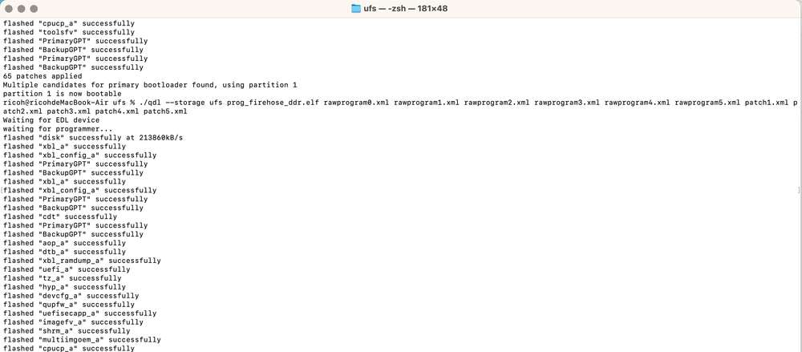
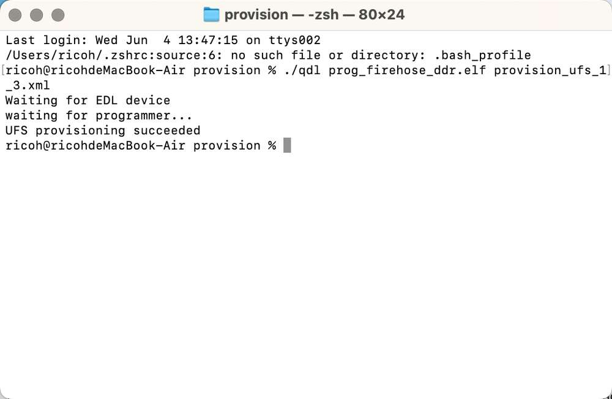

# Flash images on a Mac system

1. Run the following command to install Homebrew (if you have installed it, skip this step).

```shell
/bin/bash -c "$(curl -fsSL https://raw.githubusercontent.com/Homebrew/install/HEAD/install.sh)"
```

2. Run the following commands to install libusb and libxml2.

```shell
brew install libusb
brew install libxml2
```

3. Go to the *ufs* directory of the FlatBuild package.

4. Copy the contents from the *QDL_Mac_x64* or *QDL_Mac_ARM* directory to the *ufs* directory, depending on your host architecture.

5. Run the following command to flash the image.
   
```shell
./qdl --storage ufs prog_firehose_ddr.elf rawprogram*.xml patch*.xml
```



6. If your RUBIK Pi 3 fails to boot up after flashing, enter the *provision* directory in the FlatBuild package and run the following command to try provisioning UFS.
   
:::warning
>
> After provisioning, some information stored in the UFS, such as the SN and Ethernet MAC address, may be lost.
>
> Before running the following command, copy the *qdl* file from the *QDL_Linux_x64* or *QDL_Linux_ARM* directory to the *provision* directory, depending on your host architecture.
:::

```shell
./qdl prog_firehose_ddr.elf provision_ufs_1_3.xml
```



:::warning
>
> After provisioning, remove and plug in the power supply and USB cable to restart your RUBIK Pi 3 and proceed with the image flashing again.
::: 